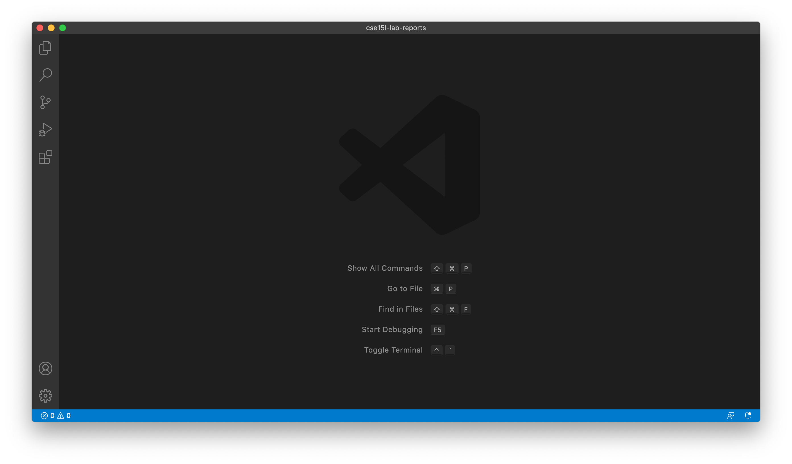
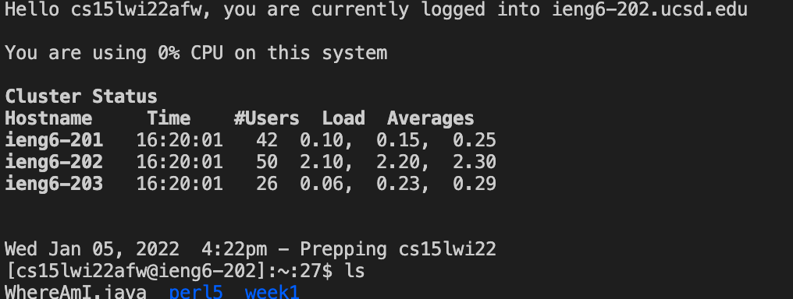
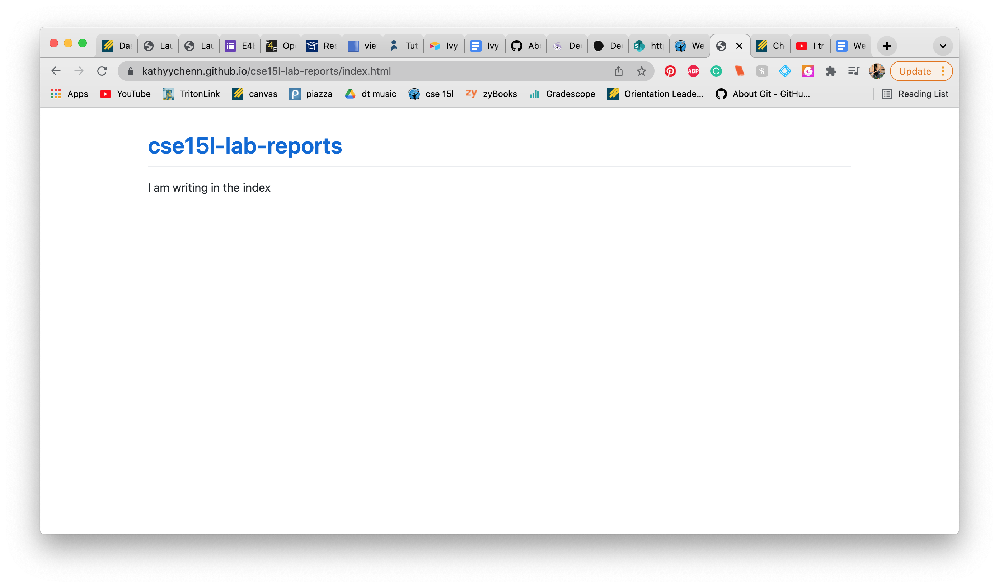

# Lab Report #1
## Tutorial: Logging into a course-specific account on ieng6

**Step 1: Installing VS Code**

First we need to install our IDE, in this case we will be using VS Code! To install it click on the following link:
[VSCode](https://code.visualstudio.com/)

Once you have installed VSCode, when you open it it should look somthing like this!

**Step 2: Remotely Connecting**

Next, in VS Code open a terminal and type and type the following command (replace "zz" with your UCSD username):

`$ ssh cs15lwi22zz@ieng6.ucsd.edu`

If this is your first time logging in, you may see a message asking if you are you would like to connect. Say yes to connecting by typing yes. Then enter your UCSD password - you will not be able to see the password on the screen as you type, but don't fret it is really there! If you successfully log in, there should be a message similar to the following:

If so, then yay, you have successfully connected to a remote server (woop)!

**Step 3: Trying Some Commands**

Now that you have remotely connected, here is a list of commands you can try out!

* `cd`
* `ls`
* `ls - a`
* `ls - lat`
* `cp /home/linux/ieng6/cs15lwi22/public/hello.txt ~/`
* `cat /home/linux/ieng6/cs15lwi22/public/hello.txt`

To log out of the remote server, type the command `exit` or press command-d.

**Step 4: Moving Files with scp**

**Step 5: Setting an SSH Key**

**Step 6: Optimizing Remote Running**

[Lab Report 1](lab-report-1-week-2.html)

[Lab Report 1](https://kathyychenn.github.io/cse15l-lab-reports/lab-report-1-week-2.html)