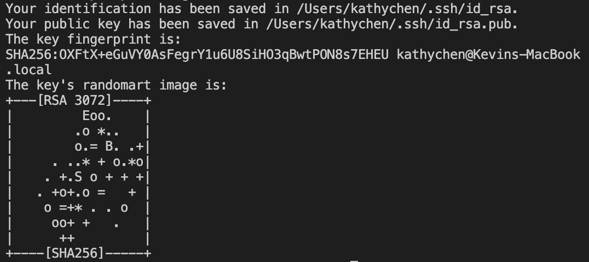

# Lab Report #1
## Tutorial: Logging into a course-specific account on ieng6

**Step 1: Installing VS Code**

First we need to install our IDE, in this case we will be using VS Code! To install it click on the following link:
[VSCode](https://code.visualstudio.com/)

Once you have installed VSCode, when you open it it should look somthing like this!

**Step 2: Remotely Connecting**

Next, in VS Code open a terminal and type and type the following command (replace "zz" with your UCSD username):

`$ ssh cs15lwi22zz@ieng6.ucsd.edu`

If this is your first time logging in, you may see a message asking if you are you would like to connect. Say yes to connecting by typing yes. Then enter your UCSD password - you will not be able to see the password on the screen as you type, but don't fret it is really there! If you successfully log in, there should be a message similar to the following:

If so, then yay, you have successfully connected to a remote server (woop)!

**Step 3: Trying Some Commands**

Now that you have remotely connected, here is a list of commands you can try out!

* `cd`
* `ls`
* `ls - a`
* `ls - lat`
* `cp /home/linux/ieng6/cs15lwi22/public/hello.txt ~/`
* `cat /home/linux/ieng6/cs15lwi22/public/hello.txt`

You may be wondering what the difference is between the different `ls` commands. Let's compare `ls` and `ls -a`. Take a look at the following screenshot:

As you can see, `ls -a` shows more files. This is because it shows all of the hidden files (known as the "dot" files). How fun!

To log out of the remote server, type the command `exit` or press command-d.

**Step 4: Moving Files with scp**

Next we will learn of a command called `scp` which can copy files from a local computer to a remote server! `scp` is always run from the client (which is the local computer). If you have a desired file you would like to copy already, feel free to use that. For now, we will be using, as an example, the file WhereAmI.java. 

First, run the following command from the directory of the file: 
`scp WhereAmI.java cs15lwi22zz@ieng6.ucsd.edu:~/`

If the file successfully copies, the terminal should produce this message:

Next, just like ssh, enter your password. Then, connect to the remote server using ssh just like before and by using the `ls` command you should now see your new copied file in the list of files on the remote server!

**Step 5: Setting an SSH Key**

Connecting to a remote server using the ssh command can get inconvenient when you have to type your password everytime, but luckily there is another way! To set up an SSH key, first type the command `ssh-keygen` into the terminal of your client (your computer). Next it will ask you which file you would like to save your key locally in, press enter. Then it will prompt you to enter your password twice. If all goes well, you should receive a message like the following:

Now you have two new different files: one of them is the private key which you will keep on the client server and the other is the public key which needs to be copied to the  server. To do this, first start by using the `ssh` command to log in to the server as we normally do. Next we need to make a directory in the server called .ssh. To do this type the following command:
`mkdir .ssh`
Next exit the server. In the client, we will use the `scp` command to copy the public key to the server. Type the following command, replacing with your own userame and path.

`scp /Users/kathychen/.ssh/.id_rsa.pub. cs15lwi22afw@ieng6.ucsd.edu:~/.ssh/authorized_keys`

Now you can connect to the server and scp without having to type in your password everytime - this should make things a little more convenient!

**Step 6: Optimizing Remote Running**

[Lab Report 1](lab-report-1-week-2.html)

[Lab Report 1](https://kathyychenn.github.io/cse15l-lab-reports/lab-report-1-week-2.html)