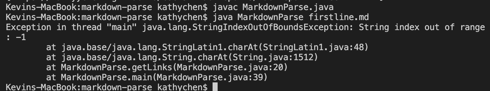

# Lab Report #2
## Debugging Labs 3 & 4

**Code Change 1: Image Present**

[File with image](https://github.com/kathyychenn/markdown-parse/blob/e163154ba3fa8ff3dc54a3646fa51007fb37f502/new-file.md)

The first bug our group encountered was with the markdown file `new-file.md` which had an image present causing getLinks to print the image file name and the link instead of just the link. This happened because originally the getLinks method was written to  print anything that was written inside a set of parentheses. To fix this bug, we wrote an if statement to check if there was an '!' before the first open bracket and if there was then `currentIndex ` would be updated to one greater than  `closeParen `, effectively skipping past the image file name.

**Code Change 2: Link in First Line**

[File with link in first line](https://github.com/kathyychenn/markdown-parse/blob/55c0abb952f73c73646e9d5cb26234d6f39d91a6/firstline.md)

The second bug we encountered was with the file `firstline.md` which had a link present in the first line of the file causing getLinks to throw an index out of bounds exception. This happened because after including the if statement to check for '!' in getLinks, now aytime there is an open bracket at index 0, the if statement will search if there is a '!' at an index of -1 which is illegal. To fix this bug, we modified our if statement so that it only checks if '!' is present if `nextOpenBracket` does not equal 0.

**Code Change 3: No Parentheses**

[File with no parentheses](https://github.com/kathyychenn/markdown-parse/blob/7f4aa679e296d8b6fb536f7f42994a4a26afacd3/no-paren.md)

The third bug we encountered was with the file `no-paren.md` which had no set of parentheses and thus no link present, causing getLinks to throw another index out of bounds exception. This happened because when checking for an index of '(' or ')', the variables `openParen` and `closeParen` were both set to -1, and as the method tried to call `markdown.substring(openParen + 1, closeParen)`, it tried to create a substring from index 0 to -1. To fix this bug, we added an aditional if statement before adding the substring to check if `openParen` equals -1 and if so it would return an empty set of brackets because there were no links present.