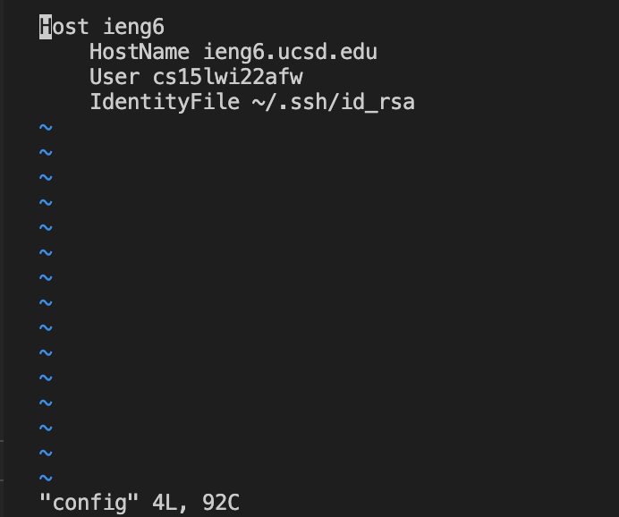
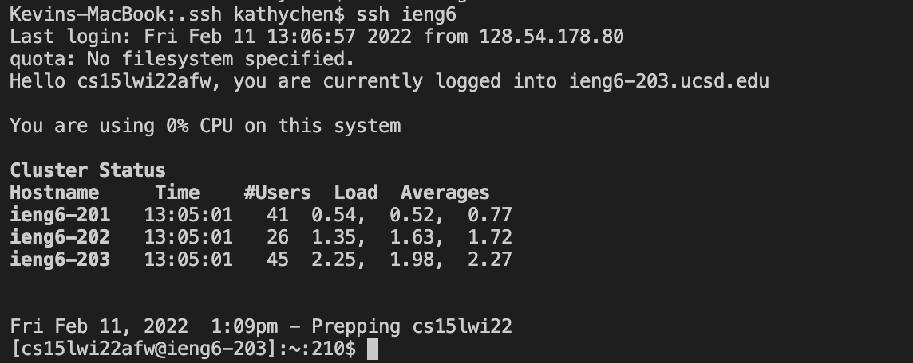
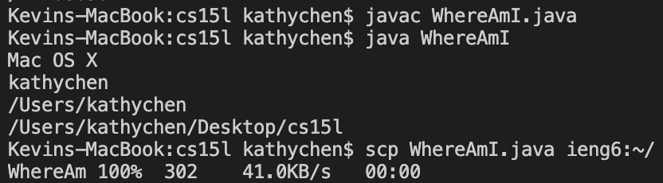
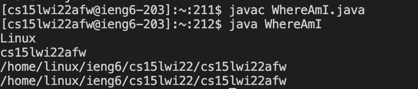

# Lab Report #3
## Streamlining ssh Configuration

**My .ssh/config File**

This is my ssh config file where I named the host ieng6 and my username cs15lwi22afw. I edited this file in VS Code by using the command `cd .ssh` to change into my .ssh directory and the command `vim config` to view the config file. I additionally included the IdentityFile reference to id_rsa in the .ssh directory so I could ssh into ieng6 without entering my password.

**ssh Log In with Alias**

This is a photo of my successful ssh log in using my new alias, ieng6. As you can see, it does not ask for me to enter my password because it referenced the path to access the key in my .ssh directory! Logging in with this alias will reduce the number of keystrokes necessary as I no longer need to type in the entire ieng6 address.

**scp Copy with Alias**

This is a photo of me copying the file WhereAmI.java from my client to the ieng6 server utilizing the `scp` command with my new alias. As you can see, first I compile and run WhereAmI.java from the client which then prints information about the client. Next I use the `scp` command with the alias to copy WhereAmI.java to the ieng6 server.

After copying the WhereAmI.java, I demonstrated the successful copying to the server as when I run WhereAmI.java it prints successfully.
