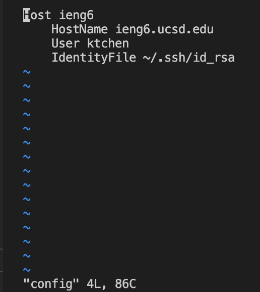

# Lab Report #3
## Streamlining ssh Configuration

**My .ssh/config File**

This is my ssh config file where I named the host ieng6 and my username ktchen. I edited this file in VS Code by using the command `cd .ssh` to change into my .ssh directory and the command `vim config` to view the config file. 

