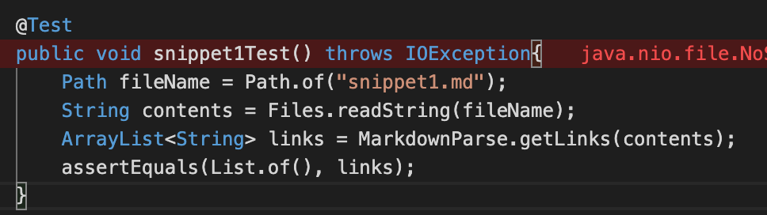
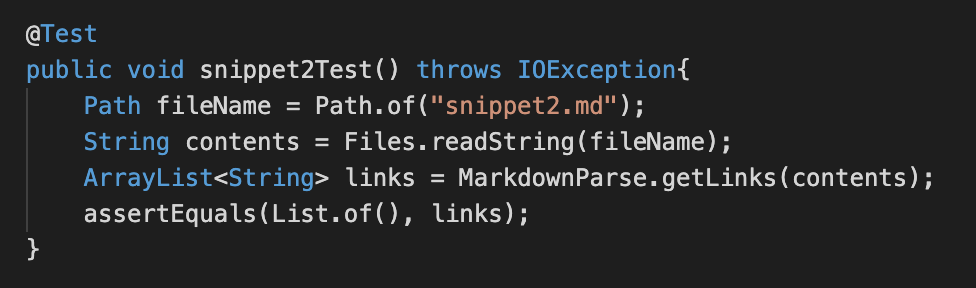
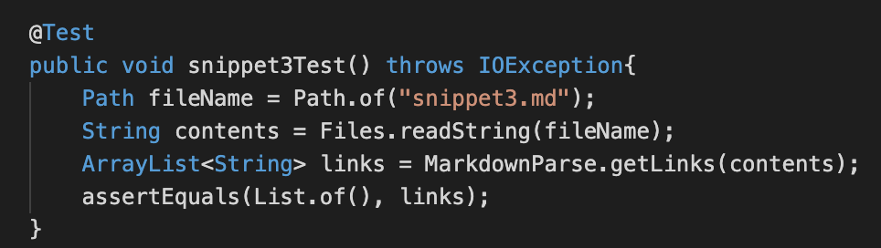
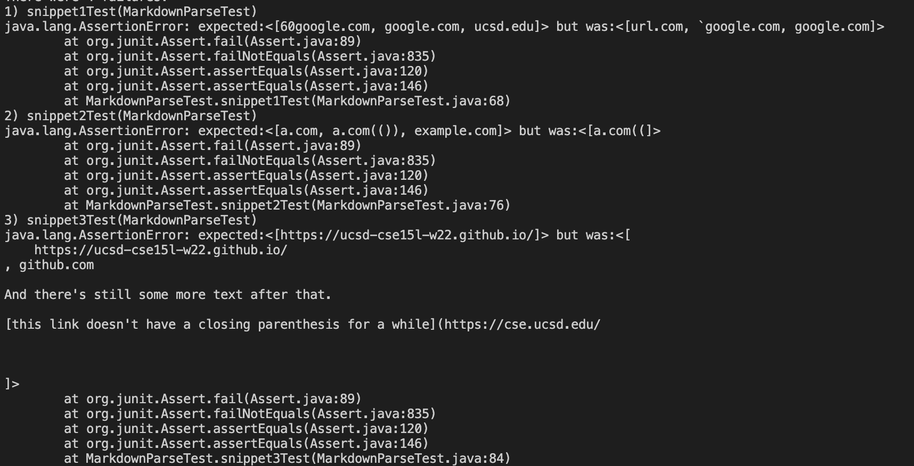
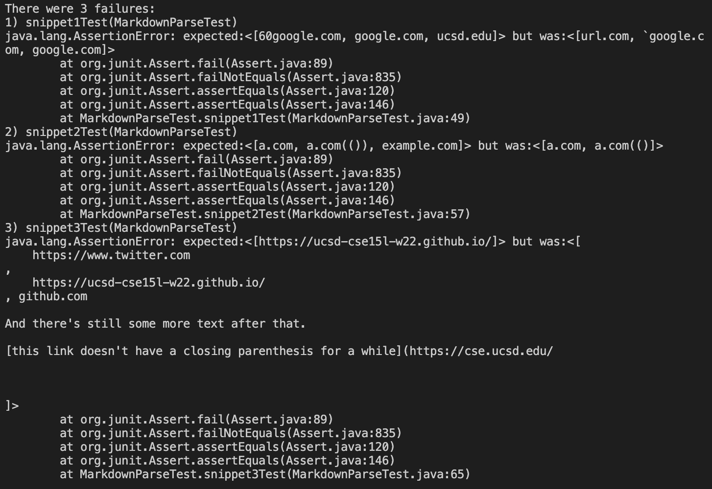

# Lab Report #4: Week 8

**Links to markdown-parse Repositories**

1. [My markdown-parse repository](https://github.com/kathyychenn/markdown-parse.git)
2. [markdown-parse repository reviewed during lab](https://github.com/kathyychenn/MarkDownParse.git)

## Expected Outputs ##

**Snippet 1**

```
`[a link\`](url.com)

[another link](`google.com)`

[`cod[e`](google.com)

[`code]`](ucsd.edu)
```

Expected Output: [google.com, ucsd.edu]

MarkdownParseTest.java implementation:



**Snippet 2**

```
[a [nested link](a.com)](b.com)

[a nested parenthesized url](a.com(()))

[some escaped \[ brackets \]](example.com)
```

Expected Output: [a.com, a.com(()), example.com]

MarkdownParseTest.java implementation:



**Snippet 3**

```
[this title text is really long and takes up more than 
one line

and has some line breaks](
    https://www.twitter.com
)

[this title text is really long and takes up more than 
one line](
    https://ucsd-cse15l-w22.github.io/
)


[this link doesn't have a closing parenthesis](github.com

And there's still some more text after that.

[this link doesn't have a closing parenthesis for a while](https://cse.ucsd.edu/


)

And then there's more text
```

Expected Output: [https://ucsd-cse15l-w22.github.io/]

MarkdownParseTest.java implementation:



## Test Results ##

**My Repository**



**Reviewed Repository**



## Possible Code Fixes ##

**Snippet 1**

There is a small possible code fix for Snippet 1 by checking that if there is a backtick present within the brackets, its corresponding partner backtick must also be present within the brackets. This can be done by having the MarkdownParse getLinks method set currentIndex to the index after the first backtick, and if there is a second backtick present within the set of brackets then it will go ahead and add the corresponding link to getLinks by setting currentIndex to the index after the bracket. Otherwise, it will have currentIndex skip to the next occurence of an open bracket.

**Snippet 2**

I believe there is a code change to accomodate for the errors of Snippet 2 but I don't believe that it will be less than 10 lines because we have to account for a possible nest in the link name and in the URL which would require two different if statements. We would also have to include an if statement regarding the presence of other characters, such as the escape character present for the link `example.com` to set currentIndex in a way that the link will still be added to the list of links returned.

**Snippet 3**

I believe there is a code change to accomodate for the errors of Snippet 2 but I don't believe that it will be less than 10 lines because we have to account for line breaks within the link name within the brackets and the actual URL within the parentheses which would require multiple if statements to determie if line breaks are present using the indexOf method. Additionally, we also need to include another if statement to account for links without closing parentheses which would require another call to the indexOf method.
