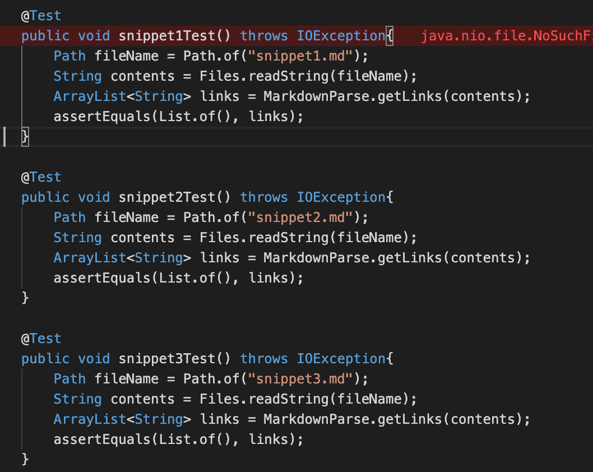
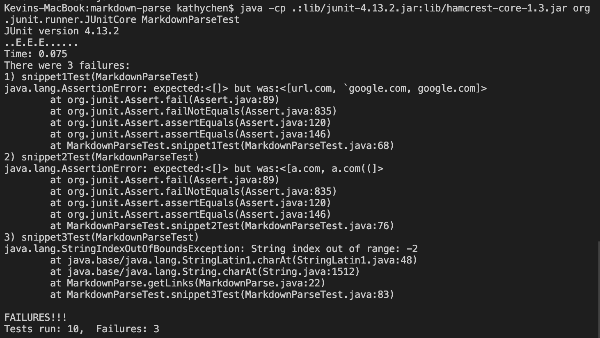

# Lab Report #4: Week 8

**Links to markdown-parse Repositories**

1. [My markdown-parse repository](https://github.com/kathyychenn/markdown-parse.git)
2. [markdown-parse repository reviewed during lab](https://github.com/kathyychenn/MarkDownParse.git)

## Expected Outputs ##

**Snippet 1**

```
`[a link\`](url.com)

[another link](`google.com)`

[`cod[e`](google.com)

[`code]`](ucsd.edu)
```

Expected Output: [google.com, ucsd.edu]

**Snippet 2**

```
[a [nested link](a.com)](b.com)

[a nested parenthesized url](a.com(()))

[some escaped \[ brackets \]](example.com)
```

Expected Output: [a.com(()), example.com]

**Snippet 3**

```
[this title text is really long and takes up more than 
one line

and has some line breaks](
    https://www.twitter.com
)

[this title text is really long and takes up more than 
one line](
    https://ucsd-cse15l-w22.github.io/
)


[this link doesn't have a closing parenthesis](github.com

And there's still some more text after that.

[this link doesn't have a closing parenthesis for a while](https://cse.ucsd.edu/


)

And then there's more text
```

Expected Output: [https://ucsd-cse15l-w22.github.io/]

## MarkdownParseTest.java Implementation of Snippet Tests##



## Test Results:
**My Repository**


**Reviewed Repository**

