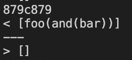
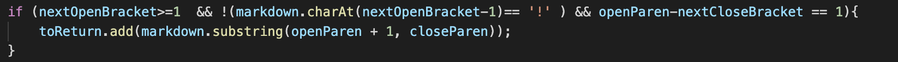

# Lab Report #5: Week 10

**Finding the Test Results**

To find the test results for both tests, first I ran the `bash script.sh` command for both my implementation markdown-parse and the provided implementation from lab 9 and stored it in the text files `results.txt` and `new-results.txt` respectively. Then, to find the differences between the files I ran the diff command `diff markdown-parse-lab-9/markdown-parse/results.txt cse15lmarkdown-parse/markdown-parse/new-results.txt`.

## Test One: Test File 498.md

[File 498.md](498.md)

Expected Output: [foo(and(bar)]

My implementation of markdown parse produced the incorrect output of case 498 because it did not include foo(and(bar)) as a valid link.

**The bug:**

The reason why foo(and(bar)) was not included as a link was because at the beginning of the getLinks method, nextOpenBracket was set to 0 because the open bracket is the first character of the line. Therefore, when the if statement checks if `!(markdown.charAt(nextOpenBracket-1)== '!' )`, nextOpenBracket - 1 = -1 and therefore the if statement will not be able to check whether there is a `!` at the correct index because -1 is not a valid index and therefore the if statement cannot evaluate to true and add the link to the return array.

