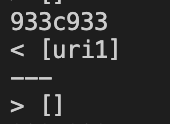

# Lab Report #5: Week 10

**Finding the Test Results**

To find the test results for both tests, first I ran the `bash script.sh` command for both my implementation of markdown-parse and the provided implementation from lab 9 and stored it in the text files `results.txt` and `new-results.txt` respectively. Then, to find the differences between the files I ran the diff command `diff cse15lmarkdown-parse/markdown-parse/new-results.txt markdown-parse-lab-9/markdown-parse/results.txt`.

## Test One: Test File 498.md

[File 498.md](498.md)

Expected Output: [foo(and(bar)]

My implementation of markdown parse produced the incorrect output for file 498 because it did not include foo(and(bar)) as a valid link.

**The bug:**

The reason why foo(and(bar)) was not included as a link was because at the beginning of the getLinks method, nextOpenBracket was set to 0 because the open bracket is the first character of the line. Therefore, when the if statement checks if `!(markdown.charAt(nextOpenBracket-1)== '!' )`, nextOpenBracket - 1 = -1. The if statement will not be able to check whether there is a `!` at the correct index because -1 is not a valid index which causes the if statement to not be able evaluate to true and add the link to the return array. To fix this bug, we need to find a new way to determine whether there is a `!` in front of the open bracket only when the nextOpenBracket does not equal 0.

## Test Two: Test File 519.md

[File 519.md](519.md)

Expected Output: [uri3]

Both my implementation and the provided implementation for lab 9 of MarkdownParse produced the incorrect ouptut for file 519 because mine did not add it to the return array of links and the provided implementation added uri1 instead of uri3.

**The Bug (provided implementation)**

.png)

The reason why uri1 was included as the link and not uri3 is because the provided implementation of the getLinks method account for nested parentheses but does not accounts for nested brackets. Therefore, to fix the bug we need to write a method similar to `closeParen` which was used to determine the index of closeParen in the instance of nested parentheses. As shown by the photo, the nextCloseBracket index is set to the first occurence of a close bracket without checking to see how many open brackets came before it.

